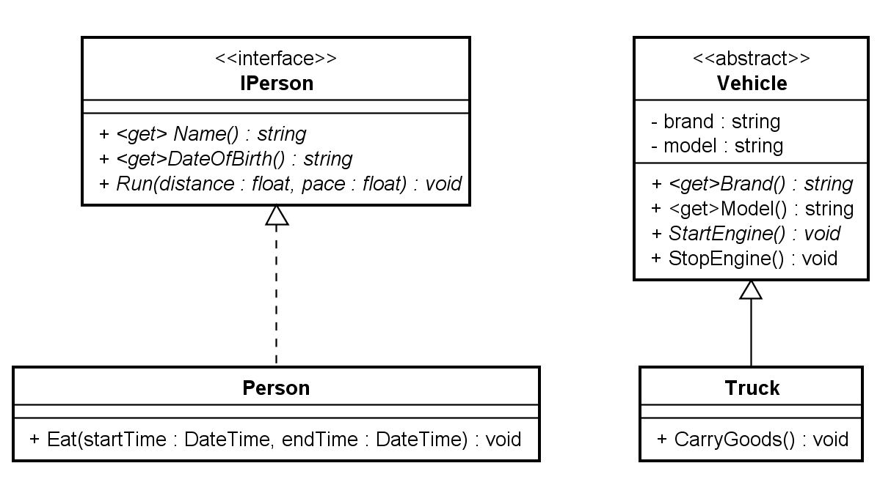

# 226b - AbstractVsInterface

## Sujet à traiter
Petit projet démontrant le fonctionnement d'une interface et d'une classe abstraite.

### Prise en main du code

1)  Récupérer le dépôt

```
    git clone <url du dépôt>
```
   
2) Réaliser la première compilation. Il est important que le réseau soit disponible. Le gestionnaire de dépendences (Nguet) en a besoin pour fonctionner correctement.

```
2>------ Build started: Project: Console, Configuration: Debug Any CPU ------
2>Console -> C:\Users\nicolas.glassey\MyDevs\CPNV\CFC\226\226b\InterfaceVsAbstract\Console\bin\Debug\net6.0\Console.dll
========== Build: 2 succeeded, 0 failed, 0 up-to-date, 0 skipped ==========
========== Build completed at 16:52 and took 00.508 seconds ==========
```


3) Etudier le diagramme de classe et le diagramme de séquence



4) Liser le code, de nombreux commentaires sont présents

5) Voici une vidéo vous aidant à prendre en main le code

6) Faites des modifications, regarder comment les différentes classes réagissent:

* TODO
    * [Progam.cs] Tenter d'instancier aussi bien une interface qu'une classe abstraite
    * [IPerson.cs] Modifier les signatures et observer les erreurs provoquées dans les classes
    * [Vehicle.cs] Modifier les signatures de la classe abstraite et observer les erreurs provoquées dans les classes